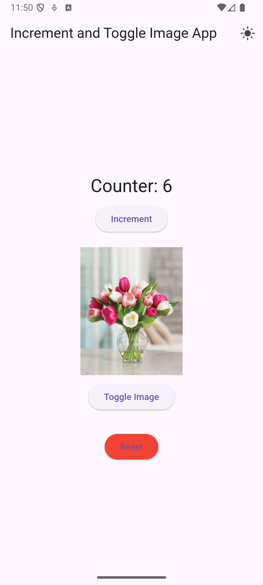
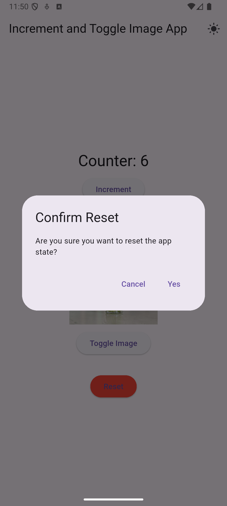
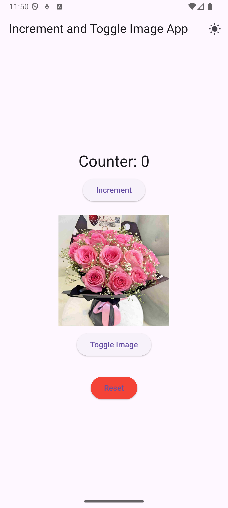
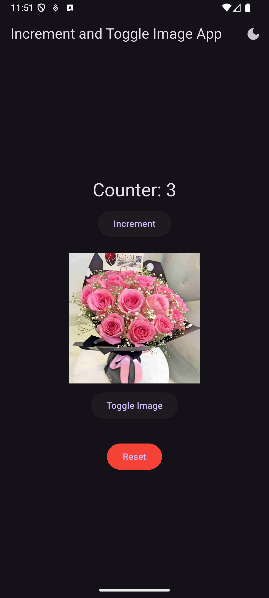

# Counter & Image Toggle App (CW1)

This Flutter app was developed for **CSC 4360/6370 - Coursework 1**.  

## ✨ Features
- Counter with increment button  
- Image toggle with fade animation  
- Light/Dark mode toggle (dynamic theme switching)  
- Reset button with confirmation + persistent storage using SharedPreferences  

The app also **remembers its state** between sessions (counter value and image choice are saved).  

---

## 📸 Screenshots










---

## 🚀 How to Run

1. Clone the repository:
   ```bash
   git clone <your-repo-link>.git
   cd counter_app
